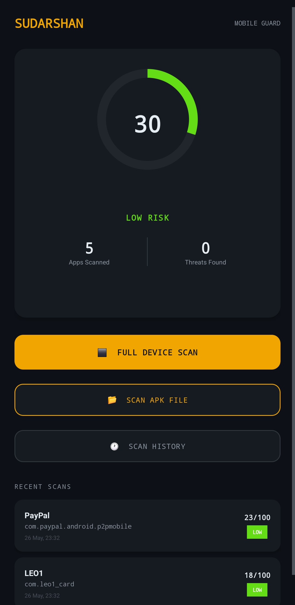
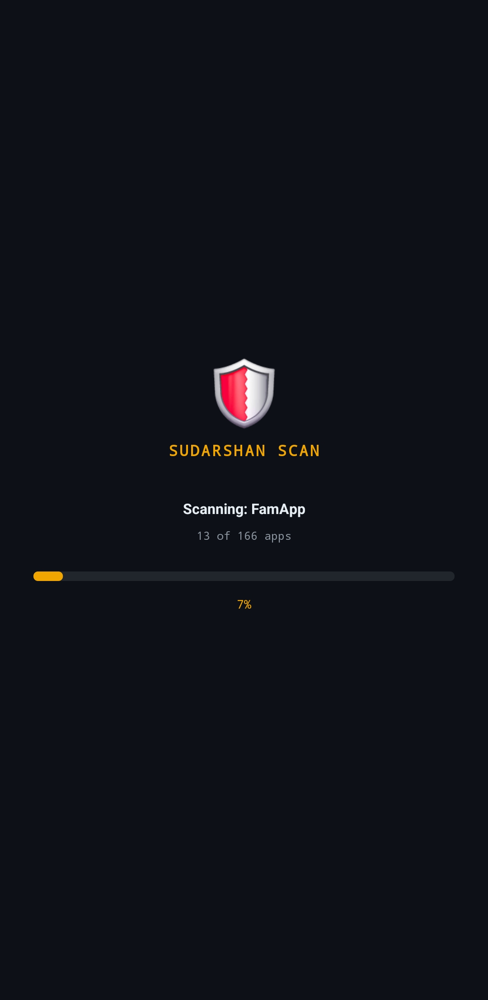
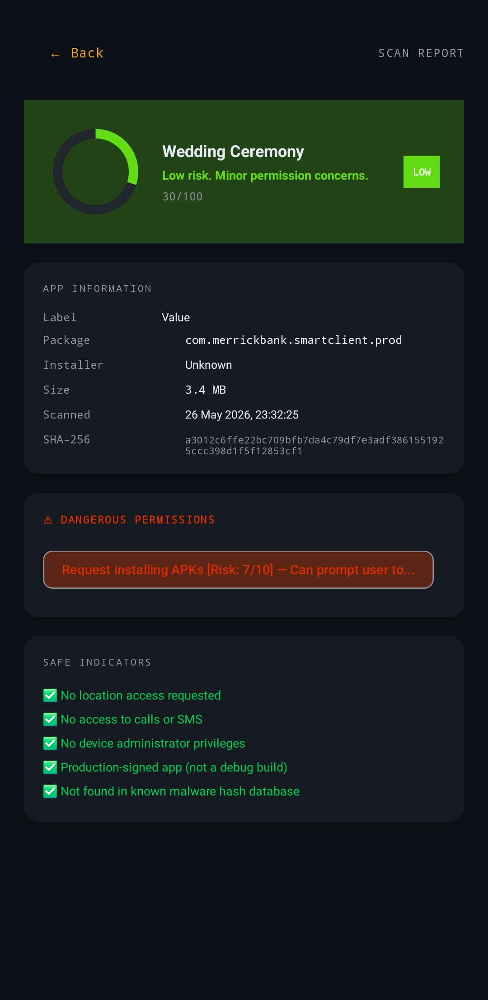
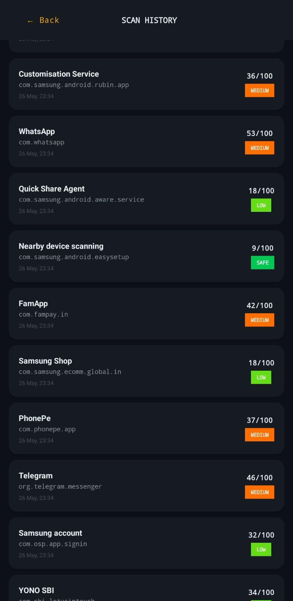

<div align="center">

# 🛡️ Sudarshan Mobile Guard

**A powerful offline-first Android malware detection app**  
*3-Layer Security Engine | No Internet Required | Real-time Protection*


> *"Like Sudarshan Chakra protects from every direction — this app gives your phone 360° security"*

</div>

---

## 📱 About

Sudarshan Mobile Guard is a full Android security application that detects malicious apps using a **3-layer offline detection engine**. No internet connection is required for core scanning — your data stays on your device.

---

## 📸 Screenshots

| Dashboard | Scanning | Report | History |
|-----------|----------|--------|---------|
|  |  |  |  |

---

## 🎯 Problem Statement

In India today:
- 📊 **67%** of Android users install APKs from unknown sources
- 💸 Banking trojans cause **₹1000+ crore** in fraud every year
- 📵 Existing antivirus apps are **internet-dependent** — useless without data
- 🔍 Users have no way to know what an app is **silently doing**

**Sudarshan Mobile Guard** solves this — completely **offline**, completely **transparent**.

---

## 🔬 3-Layer Detection Engine
APK File Input
│
▼
┌──────────────────────────────────┐
│   LAYER 1 — Hash Engine  (40%)   │
│   SHA-256 fingerprint matching   │
│   30+ known malware families     │
└──────────────────────────────────┘
│
▼
┌──────────────────────────────────┐
│   LAYER 2 — Permission AI (40%)  │
│   30+ dangerous permissions      │
│   Context Mismatch Detection     │
└──────────────────────────────────┘
│
▼
┌──────────────────────────────────┐
│   LAYER 3 — Behavior  (20%)      │
│   Installer origin check         │
│   Brand spoofing detection       │
│   Hidden app detection           │
└──────────────────────────────────┘
│
▼
Final Risk Score (0–100)
### Layer 1 — SHA-256 Hash Engine
- Computes a **SHA-256 cryptographic fingerprint** of every APK file
- Matches against a database of **30+ documented malware families**
- Families covered: `BankBot` `Joker` `Triada` `Cerberus` `BlackRock` `AhMyth RAT` `SpyMax` `Hydra` `EventBot` `DroidJack` `Simplocker` and more
- A hash match triggers a **minimum risk floor of 80/100**

### Layer 2 — Permission Intelligence Engine
- **30+ dangerous permissions** profiled with real-world abuse scenarios
- **Context Mismatch Detection** flags illogical permission combinations:

| App Type | Requested Permission | Risk Flag |
|----------|---------------------|-----------|
| Flashlight app | GPS Location | 🚨 Suspicious |
| Calculator app | Read SMS | 🚨 Suspicious |
| Game app | Send SMS | 🚨 Premium Fraud Risk |
| Any app | Overlay + Accessibility | 🔴 Banking Trojan Signature |

### Layer 3 — Behavior Pattern Analyzer
- **Installer origin check** — sideloaded APKs are automatically flagged
- **Brand spoofing detection** — identifies fake SBI, PayTM, Google apps
- **Typosquatting detection** — catches patterns like `g00gle`, `facebok`, `whatsaap`
- **Hidden app detection** — apps with no launcher icon are flagged
- **Suspicious component names** — services named keylog, spy, monitor are flagged

---

## 🚀 Features

| Feature | Description |
|---------|-------------|
| 📱 Full Device Scan | Scan all installed user apps at once |
| 📂 APK File Scanner | Check any APK file before installing it |
| 🔄 Auto-Scan | Automatically scans every new app on install |
| 📴 Offline-First | Zero internet required for core scanning |
| 📊 Risk Score | 0–100 real-time device health gauge |
| 📋 Detailed Reports | SHA-256 hash, permissions, behavior findings |
| 🕐 Scan History | All past scans saved in local database |
| 🔔 Threat Alerts | Instant notification when a threat is detected |
| 🔁 Boot Protection | Guard service auto-restarts after device reboot |

---

## 📊 Risk Level System

| Score | Level | Action |
|-------|-------|--------|
| 0–15 | 🟢 SAFE | No action needed |
| 16–35 | 🟡 LOW | Monitor the app |
| 36–60 | 🟠 MEDIUM | Review permissions carefully |
| 61–80 | 🔴 HIGH | Uninstall advised |
| 81–100 | ⬛ CRITICAL | Uninstall immediately |

---

## 🛠️ Tech Stack

| Component | Technology |
|-----------|-----------|
| Language | Java 17 |
| Minimum SDK | Android 8.0 (API 26) |
| Target SDK | Android 14 (API 34) |
| Database | Room (SQLite) |
| UI Framework | Material3 Dark Theme |
| Architecture | Modular Security Architecture |
| Hash Algorithm | SHA-256 (Java MessageDigest) |
| Background | Foreground Service + BroadcastReceiver |

---

## 🛡️ Malware Families Covered

| Family | Type | Severity |
|--------|------|----------|
| BankBot | Banking Trojan | 🔴 95/100 |
| Joker | SMS Fraud Spyware | 🔴 90/100 |
| Cerberus | Banking Trojan | 🔴 97/100 |
| Triada | Pre-installed Backdoor | 🔴 99/100 |
| AhMyth | Remote Access Trojan | 🔴 97/100 |
| BlackRock | Banking Trojan | 🔴 94/100 |
| Hydra | Banking Trojan | 🔴 93/100 |
| DroidJack | RAT | 🔴 98/100 |
| Simplocker | Ransomware | 🔴 99/100 |
| HiddenAds | Adware | 🟠 60/100 |

---

## 📂 Project Structure
app/src/main/java/com/sudarshan/mobileguard/
├── activities/
│   ├── SplashActivity.java
│   ├── MainActivity.java         ← Dashboard + Risk Gauge
│   ├── ScanActivity.java         ← Live scan progress
│   ├── ReportActivity.java       ← Detailed threat report
│   └── HistoryActivity.java      ← All past scans
├── engine/
│   ├── ScanEngine.java           ← Master orchestrator
│   ├── HashEngine.java           ← Layer 1: SHA-256
│   ├── MalwareHashDatabase.java  ← 30+ malware hashes
│   ├── PermissionIntelligenceEngine.java  ← Layer 2
│   └── BehaviorPatternAnalyzer.java       ← Layer 3
├── services/
│   ├── InstallMonitorService.java ← Persistent guard
│   ├── PackageInstallReceiver.java← Auto-scan trigger
│   └── BootReceiver.java
└── database/
├── AppDatabase.java
└── ScanResultDao.java
---

## ⚙️ Installation & Setup

```bash
# 1. Clone the repository
git clone https://github.com/yatendradixit05/Sudarshan-Mobile-Guard.git

# 2. Open in Android Studio
# File → Open → Select the project folder

# 3. Sync Gradle
# File → Sync Project with Gradle Files

# 4. Run on a physical device (Android 8.0+)
# Enable USB Debugging → Connect phone → Press Shift+F10
```

**Requirements:**
- Android Studio Hedgehog or newer
- JDK 17+
- Android device running API 26+ (Android 8.0)

---

## 🔮 Future Roadmap

- [ ] VirusTotal API integration as optional cloud verification layer
- [ ] Automatic hash database updates via GitHub Actions
- [ ] DEX bytecode pattern analysis for deeper inspection
- [ ] Network behavior monitoring using Android VPN API
- [ ] PDF report export for sharing scan results
- [ ] Home screen widget displaying live risk score

---

## 👨‍💻 Developer

**Yatendra Dixit**  
B.Tech CSE — Cybersecurity Specialization

[](https://github.com/yatendradixit05)
[](mailto:yatendradixit05@gmail.com)

---

## 📜 Disclaimer

This app only analyzes apps installed on the user's own device. No data is transmitted to any external server. Malware hashes are sourced from public threat intelligence databases including MalwareBazaar, ESET, and Kaspersky public reports.

---

<div align="center">

**⭐ If you found this project helpful, please give it a star!**

*Built with ❤️ for cybersecurity — Sudarshan Mobile Guard*

</div>
